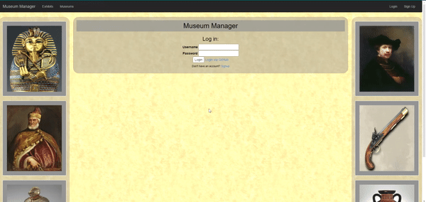
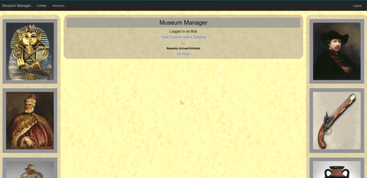

# Museum Manager

This app allows you to take the role of a museum manager where you can add, track and manage exhibits.

# Motivation
Because of my interest in museums and historical exhibits I thought why not make an application to ease the life of a museum manager. There are so many exhibits in some museums that it could get messy without an organiztional tool such as this app.

# Technologies
The following technologies were used in the production of Cleverbreak:

Ruby 2.6.0
Rails 5.2.3
Sqlite3
Thin 10.13.0
Omniauth-Github

# Features
Currently, Museum Manager has the following features implemented:

Github User Authentication

New users have the ability to register an account on the sign-in page or sign up using github.

Adding Exhibits

A user can add exhibits will detailed information ranging the type of exhibit to the dates it will arrive at the specified museum.

# Installation:

On a local machine:

- Clone this Repo
- Run 'bundle install' from the root directory
- Run 'rails db:migrate'
- Run 'rails db:seed' to see the museums
- Run 'thin start --ssl' to start up a server

Link to the application itself: https://museum-manager.herokuapp.com/
